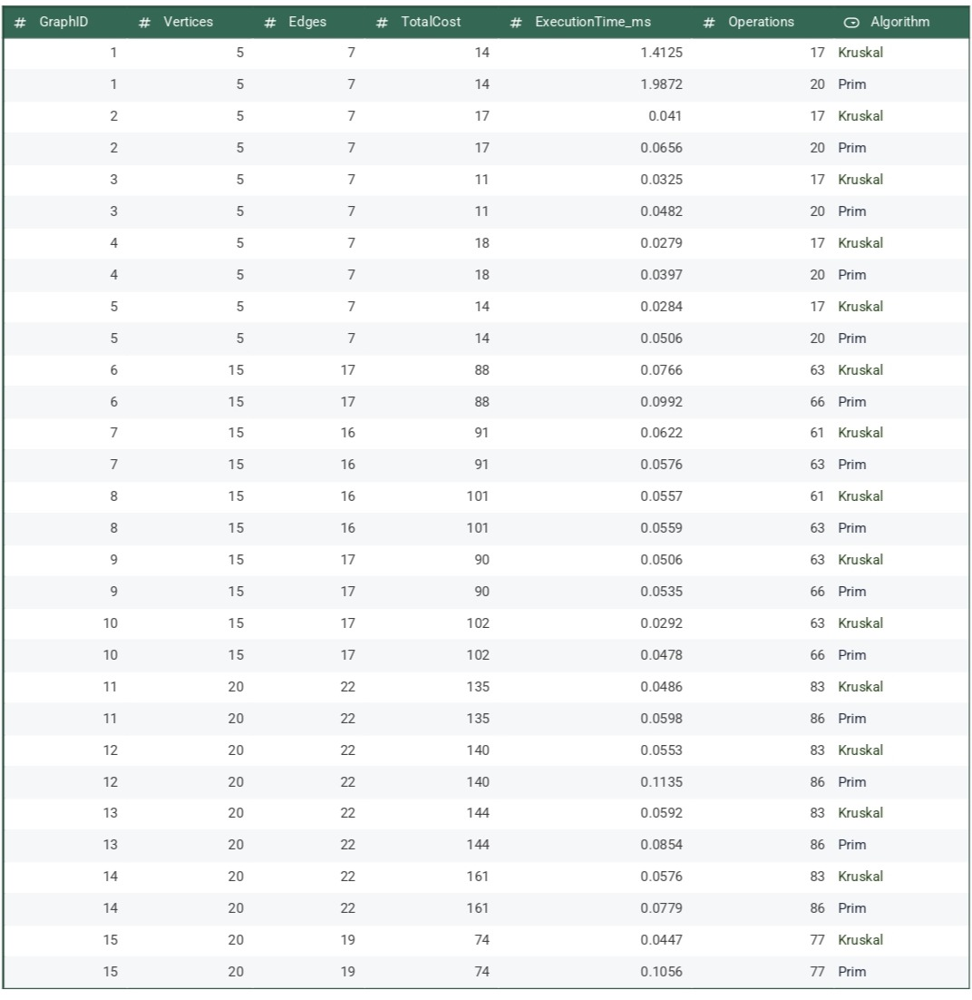

# Report for Minimum spanning tree Algorithms
## 1. A summary of input data and algorithm results
I compared Kruskal's and Prim's Algorithms on 15 graphs (stored in "input.json" file, algorithms extract the graphs from the file with help
of JsonInputReader class)
- 5 graphs with 5 nodes,
- 5 graphs with 15 nodes,
- 5 graph with 20 nodes

For each graph I recorded each algorithm's MST total cost and executions time in milliseconds.
As expected, **both algorithms produced the same MST total cost for every graph**. 
However, algorithms' operations count and execution time slightly differ due to different implementations, which is also expected.

## Implementation details
There are classes that represent Edge and Graph. The Graph stores the lists of nodes and Edges. Additionally for Kruskal's, there is DSU class.
For printing the results and converting them to json and csv, there is folder "Output Results". And also package with unit tests for both algorithms
### Kruskal's Algorithm
This algorithm is **edge-based**.
It sorts all edges by weight (ascending) and iterates through them, adding edge if it does not form a cycle. Cycle detection is implemented 
using DSU (disjoint set union) with union(x, y) - merges two sets if distinct, find(x) return root of x's set)  
Each significant operation was counted: sort, find, union, comparison    
Time **O(E logE)**, Space **O(V+E)**
### Prim's Algorithm
It has **grow-from-vertex** approach.  
Initially, I implemented this algorithm with simple edge scan approach. But it gave worse performance, taking up to 1000 operations at 
larger graphs(you can find the old implementation in the end of PrimAlgorithm as commented). So I optimized it with Priority Queue to select 
smallest edge at each step, and adjacency list to store edges for quick lookup by vertex.  
Prim's Algorithm starts from first node (may start at any). Marks the node as visited by adding to "visited" HashSet, and adds all its edges
to priority queue sorted by weight. Then it repeatedly extracts the smallest edge from the queue, if it connects visited node to unvisited one, 
it adds it to MST), and adds all edges from the newly visited node to queue as well. It continues until number of edges = number of nodes - 1, or until
queue becomes empty.
Prim's Algorithm grows the MST from starting vertex by repeatedly selecting  edge with minWeight that connects a visited vertex to unvisited one.
It tracks the visited nodes, using HashSet to store them since it shows better
performance than, for example, Array that takes O(n) for contains(), while HashSet takes O(1) for that.   
I counted the operations like add, priorityQueue.poll, comparisons.
Time **O(E logV)**, Space **O(V+E)**
### Table with results (from csv file)

## 2. A comparison between Prim’s and Kruskal’s algorithms' performance and efficiency
## In Theory:
### Kruskal's
- Greedy and edge-based
- Builds MST by sorting all edges and adding them while avoiding cycles using DSU data structure  
- Time complexity: for sorting O(E logE), DSU operations O(E)
- Space cimplexity: O(V+E)
- Best for sparse graphs (graph with few edges)
### Prim's
- Greedy and vertex-based
- Builds MST by repeatedly choosing the smallest edge that connects a visited vertex to an unvisited one. Uses Priority Queue data structure
- Time complexity: O(E logV) 
- Space complexity: O(V+E)
- Best for dense graphs (graph with many edges)
## In Practice:
### Kruskal's 
- 5-node graphs: Execution time ≈ 0.02-0.04 ms, operations ≈ 17
- 15-node graphs: Execution time ≈ 0.03–0.07 ms, operations ≈ 61–63
- 20-node graphs: Execution time ≈ 0.04–0.05 ms, operations ≈ 83
- MST total cost: same as Prim's
### Prim's
- 5-node graphs: Execution time ≈ 0.04-0.06 ms, operations ≈ 20
- 15-node graphs: Execution time ≈ 0.04–0.08 ms, operations ≈ 63-66
- 20-node graphs: Execution time ≈ 0.05-0.1 ms, operations ≈ 86
- MST total cost: same as Kruskal's 
### Analysis
Both algorithms produced the same MST costs, confirming correctness.
Kruskal’s operations and execution time were slightly lower, and the performance on small and medium graphs remains almost stable.
Prim’s (with adjacency list + priority queue) performance differs in graphs with different sizes (not that stable), however number of operations is very similar
to Kruskal's

### Summary
Both algorithms have asymptotic efficiency around O(E logV).
Kruskal’s algorithm remains slightly more stable for sparse graphs, 
while Prim’s is more efficient for dense ones, especially with the optimized implementation used here.e

## Automated Tests. 
I included automated tests that verify
the following for both Prim’s and Kruskal’s algorithms:
- tests on small (5nodes), medium (15 nodes) and large (20 nodes) algorithms
- tests to check connectivity
- tests for performance negativity (execution time and operation counts are non-negative)
- tests for reproducibility (results are reproducible for the same dataset)
- tests for cycle detection
- tests for valid edge number (the number of edges in each MST equals V − 1)
- and test where i ran two algorithms and checked that the MST results are the same

Both algorithms passed each test.

## 3. Conclusion
Both Kruskal's and Prim's algorithms correctly find Minimum Spanning Tree, 
but their efficiency differ slightly because of different implementations

### Which algorithm is preferable under different conditions:
### Graph Density
Kruskal's permorms better on sparse graphs with few edges, while Prim's is better for dense graphs when implemented with priority queue
because it selects the next smallest edge without sorting all edges.
### Edge representation
Kruskal's uses simple list structures since it processes all edges directly, while for Prim's is better to use adjacency list 
which allow quick lookups for connected edges.
 smallest edge without sorting all edges globally.
### Implementation complexity
Kruskal's is easy to implement, especially with ready DSU. Prim's easy to implement with simple edge scan logic (as i did initially), 
but priority queue approach showed better performance, though was a bit complicated. 

